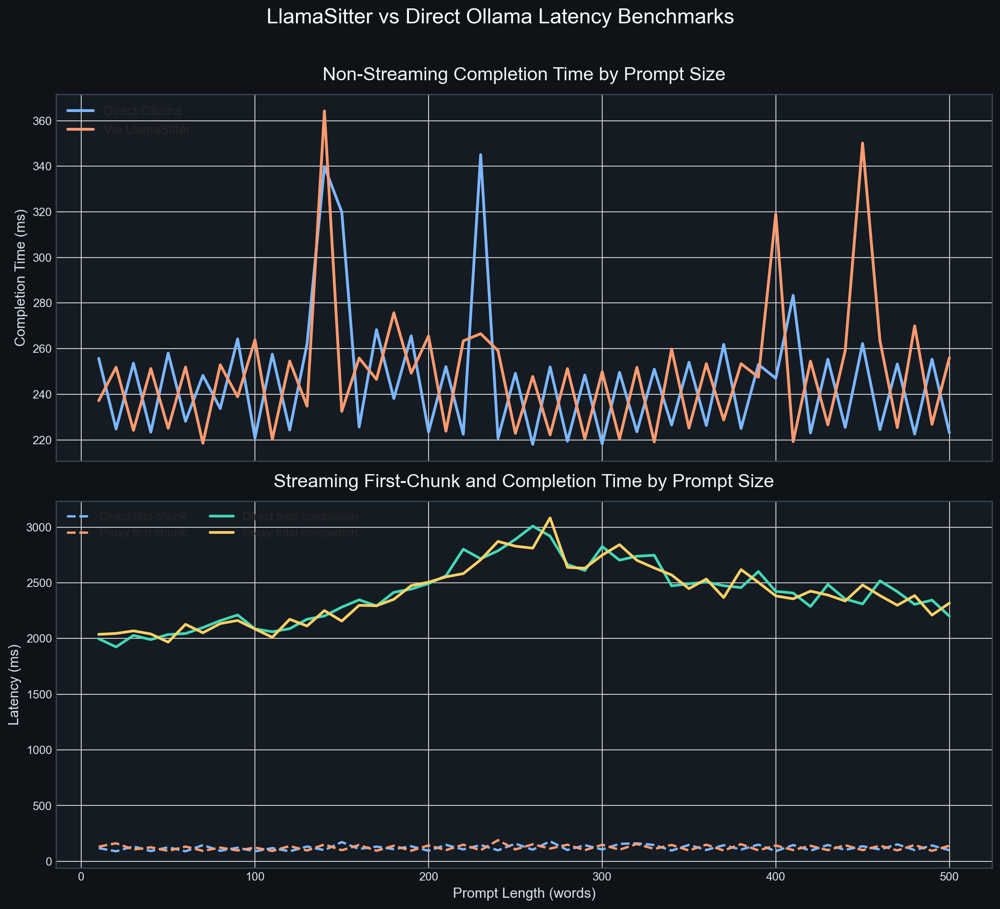
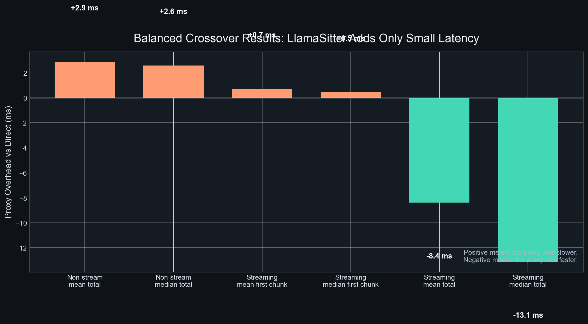

# LlamaSitter

<p align="center">
  
</p>

LlamaSitter is a lightweight, local-first observability layer for Ollama. It sits between Ollama-powered clients and the Ollama server, proxies requests transparently, and records token usage, timing metrics, request patterns, model activity, and per-agent attribution.

It is designed for developers who use Ollama through tools like OpenClaw, OpenCode, custom local agents, and direct app integrations, and want trustworthy visibility into what Ollama is actually processing.

## Why LlamaSitter?

When Ollama is used behind agent frameworks or wrappers, it becomes harder to answer practical questions like:

- How many input tokens did this request actually use?
- How many output tokens were generated?
- Which agent, instance, or run consumed those tokens?
- Does framework-side reporting match Ollama's real counters?
- Which model or workflow is causing latency or token spikes?

LlamaSitter answers those questions without requiring invasive changes to Ollama or to callers.

## Core Features

- Transparent local reverse proxy for Ollama
- Tracks prompt tokens, output tokens, total tokens, durations, and sizes
- Supports per-client, per-instance, per-agent, per-session, and per-run attribution
- Works with multiple concurrent local agent frameworks
- Uses SQLite for lightweight local persistence
- Exposes a local API, embedded dashboard, and CLI
- Defaults to metadata-only persistence for privacy
- Leaves room for later compatibility routes and richer analytics

## Alpha Scope

The current implementation targets a usable alpha:

- Native Ollama `/api/chat` support
- Streaming and non-streaming request capture
- SQLite persistence with embedded migrations
- Explicit identity headers plus listener-level default tags
- `serve`, `doctor`, `stats`, `tail`, and `export` CLI commands
- Read-only local API for requests, summaries, sessions, and exports
- Embedded local web UI for overview metrics and recent activity
- Desktop runtime helpers plus native macOS and Linux desktop shells

The following are intentionally deferred until after the core proxy path is stable:

- `/api/generate`
- Embeddings routes
- OpenAI-compatible routes
- Heuristic auto-attribution

## Identity Model

LlamaSitter separates identity into distinct layers:

- `client_type`: framework or caller type such as `openclaw`, `opencode`, or `python`
- `client_instance`: a specific instance such as `openclaw1` or `openclaw2`
- `agent_name`: the logical agent such as `research-agent`
- `session_id`: a logical conversation or session grouping
- `run_id`: a single job or execution grouping
- `workspace`: an optional working directory or project tag

Headers override defaults. The current precedence is:

1. Explicit `X-LlamaSitter-*` headers
2. Listener default tags from config
3. Empty values

See [Identity And Tags](docs/identity.md) for the detailed field-by-field guide, recommended usage, and examples.

## Example Configuration

See [config.example.yaml](config.example.yaml) for a full sample. A minimal setup looks like this:

```yaml
listeners:
  - name: default
    listen_addr: "127.0.0.1:11435"
    upstream_url: "http://127.0.0.1:11434"
    default_tags:
      client_type: "unknown"
      client_instance: "default"

storage:
  sqlite_path: "~/.llamasitter/llamasitter.db"

ui:
  enabled: true
  listen_addr: "127.0.0.1:11438"
```

## CLI

LlamaSitter ships with a nested CLI for both runtime operations and safe config management.

If you are starting fresh, the shortest path is:

```bash
llamasitter config init
llamasitter doctor --config llamasitter.yaml
llamasitter serve --config llamasitter.yaml
```

Then point your Ollama client at the configured listener, which defaults to `127.0.0.1:11435` instead of Ollama's `127.0.0.1:11434`.

Common workflows:

```bash
llamasitter doctor --config llamasitter.yaml
llamasitter config listener list --config llamasitter.yaml
llamasitter config listener add --config llamasitter.yaml \
  --name openwebui \
  --listen-addr 127.0.0.1:11436 \
  --upstream-url http://127.0.0.1:11434 \
  --tag client_type=openwebui \
  --tag client_instance=docker
llamasitter config ui set-listen-addr 127.0.0.1:11439 --config llamasitter.yaml
llamasitter completion zsh > ~/.zsh/completions/_llamasitter
```

Key CLI conventions:

- `--config PATH` selects the YAML file to inspect or mutate
- Config mutation commands support `--dry-run`
- Destructive removal commands require `--yes`
- Most inspect commands support `--output table|json|yaml`
- `llamasitter stats --output json` exposes a fuller summary than the default table output
- `llamasitter desktop config path` prints the desktop-managed config location explicitly

See [CLI Guide](docs/cli.md) for an end-to-end onboarding and workflow guide, [Identity And Tags](docs/identity.md) for the attribution model, and [CLI Reference](docs/reference/cli/llamasitter.md) for the generated command docs.

## Install and Uninstall

LlamaSitter now includes release-based install and uninstall scripts designed for a one-line setup flow.

Install the latest release:

```bash
curl -fsSL https://raw.githubusercontent.com/trevorashby/llamasitter/main/install.sh | sh
```

Uninstall LlamaSitter:

```bash
curl -fsSL https://raw.githubusercontent.com/trevorashby/llamasitter/main/uninstall.sh | sh
```

Supported install targets:

- macOS: installs [LlamaSitter.app](/Applications/LlamaSitter.app) and `/usr/local/bin/llamasitter`
- Linux: installs `/usr/local/bin/llamasitter`
- Windows: not supported by the one-line installer yet

Supported installer environment variables:

- `LLAMASITTER_VERSION`: install a specific release tag such as `v0.1.0`
- `LLAMASITTER_NO_LAUNCH=1`: install on macOS without auto-launching the app
- `LLAMASITTER_YES=1`: skip the uninstall confirmation for removing installed binaries
- `LLAMASITTER_PURGE_DATA=1` or `0`: control whether uninstall removes local data and logs

The installer does not edit shell startup files. It installs the CLI into `/usr/local/bin` and warns if that path is not currently on your shell `PATH`.

On macOS, `llamasitter serve` now best-effort launches the installed menu bar companion automatically when `LlamaSitter.app` is present, so the menu icon and dashboard can attach to the same running service even if you started it from Terminal.

On Linux, the one-line installer still installs the CLI only. The native Linux desktop shell is packaged separately as `.deb` and `.rpm` artifacts.

## Manual Install Fallback

If you want to build locally from source instead of using a release:

Build the CLI:

```bash
go build -o bin/llamasitter ./cmd/llamasitter
```

Build the macOS app bundle locally:

```bash
bash ./scripts/build-macos-app.sh
```

Build the Linux desktop shell and staged package payload locally:

```bash
bash ./scripts/build-linux-app.sh
```

Package Linux desktop artifacts with `nfpm`:

```bash
bash ./scripts/package-linux-desktop.sh
```

Package release archives manually:

```bash
bash ./scripts/package-release.sh package --version v0.1.0 --target linux/amd64
bash ./scripts/package-release.sh checksums
```

## Performance Impact

LlamaSitter is designed to be transparent enough that developers can leave it in the request path without meaningfully slowing local Ollama workflows. To validate that claim, this repo now includes repeatable benchmark harnesses under `benchmarks/` plus raw CSV outputs and documentation-ready figures under `benchmarks/results/` and `benchmarks/figures/`.

### Study Design

Two crossover benchmarks were run locally against the same machine, using the same model and the same request payloads:

- Model: `qwen3-vl:8b`
- Direct endpoint: `http://127.0.0.1:11434/api/chat`
- Proxy endpoint: `http://127.0.0.1:11435/api/chat`
- Prompt sizes: 50 lengths from 10 to 500 filler words
- Design: crossover, where each prompt length is tested once as `direct -> proxy` and once as `proxy -> direct`
- Sample size:
  - Non-streaming: 100 successful paired measurements
  - Streaming: 100 successful paired measurements

This crossover design matters because it removes most of the “second request is faster” warm-cache bias that showed up in the earlier sequential benchmark. The resulting numbers are a much better estimate of actual proxy overhead.

The scripts and raw outputs used for this section are:

- [Non-streaming crossover CSV](benchmarks/results/ollama_vs_llamasitter_crossover_latency_20260409T004023Z.csv)
- [Streaming crossover CSV](benchmarks/results/ollama_vs_llamasitter_streaming_crossover_latency_20260409T005129Z.csv)
- [Non-streaming benchmark harness](benchmarks/run_proxy_latency_benchmark.py)
- [Streaming benchmark harness](benchmarks/run_streaming_proxy_latency_benchmark.py)
- [Plotting script](benchmarks/plot_latency_benchmarks.py)

### Benchmark Figures





### Summary Values

| Scenario | Metric | Direct Ollama | Via LlamaSitter | Paired proxy delta |
| --- | --- | ---: | ---: | ---: |
| Non-streaming crossover | Mean completion time | 246.535 ms | 249.423 ms | +2.888 ms |
| Non-streaming crossover | Median completion time | 225.970 ms | 228.982 ms | +2.596 ms |
| Streaming crossover | Mean time to first chunk | 122.363 ms | 123.082 ms | +0.719 ms |
| Streaming crossover | Median time to first chunk | 99.862 ms | 101.121 ms | +0.460 ms |
| Streaming crossover | Mean total completion time | 2408.633 ms | 2400.247 ms | -8.386 ms |
| Streaming crossover | Median total completion time | 2389.098 ms | 2394.878 ms | -13.126 ms |

The paired proxy delta column comes directly from the crossover CSV summaries. Negative values do not mean the proxy is inherently faster; they mean the measured difference is small enough that normal run-to-run variance and residual cache effects can outweigh it. The practical takeaway from both studies is that LlamaSitter adds little to no meaningful latency in this local setup, with measured overhead landing around a few milliseconds.

If you want to reproduce the same figures, run the benchmark scripts again and then rerun the plotting script:

```bash
python3 benchmarks/run_proxy_latency_benchmark.py --design crossover --count 50
python3 benchmarks/run_streaming_proxy_latency_benchmark.py --design crossover --count 50
python3 benchmarks/plot_latency_benchmarks.py
```

## macOS App

A native macOS desktop wrapper now lives under [desktop/macos](desktop/macos). The visible `LlamaSitter.app` acts as the dashboard window, while an embedded background menu bar agent owns the bundled `llamasitter serve` process and keeps the status icon alive even after the dashboard window is closed.

To build a local `.app` bundle:

```bash
bash ./scripts/build-macos-app.sh
```

That produces:

```text
build/macos/LlamaSitter.app
```

Launch the bundle itself, not the inner Mach-O:

```bash
open build/macos/LlamaSitter.app
```

Do not launch `Contents/MacOS/LlamaSitter` directly unless you are intentionally debugging the bundle internals. The embedded background agent is launched automatically from the app bundle when needed.

If you start the service manually from Terminal with:

```bash
llamasitter serve --config /path/to/llamasitter.yaml
```

the installed macOS companion will also try to come up automatically and attach to that same config, so the menu icon and dashboard reflect the live service instead of starting a second backend.

## Project Docs

- [Architecture](docs/architecture.md)
- [CLI Guide](docs/cli.md)
- [CLI Reference](docs/reference/cli/llamasitter.md)
- [Development Notes](docs/development.md)
- [Implementation Checklist](ImplementationChecklist.md)
- [Development Plan](DevelopmentPlan.md)

## Status

LlamaSitter is in early implementation.
